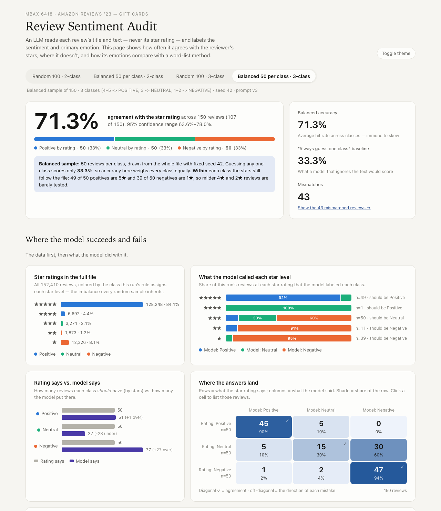
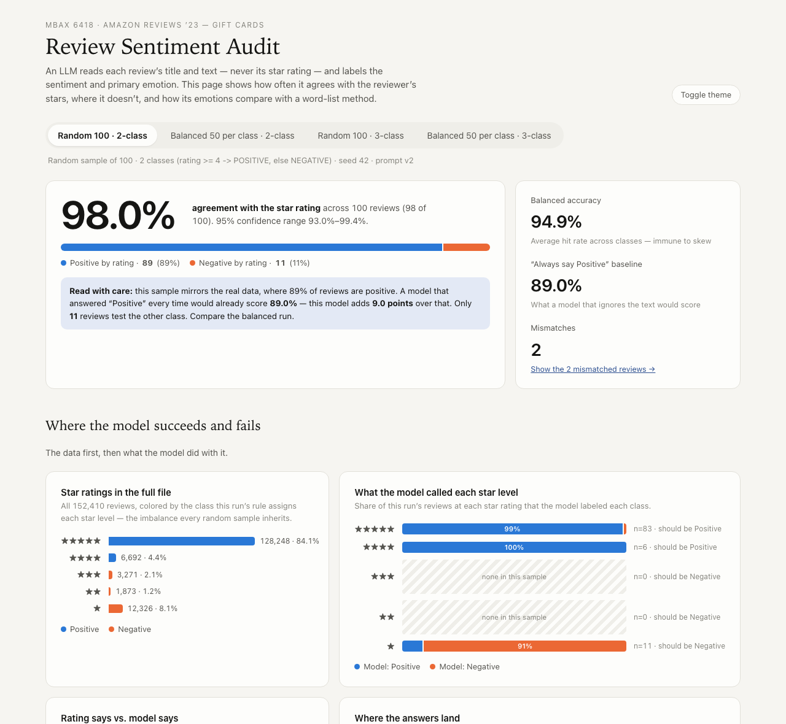
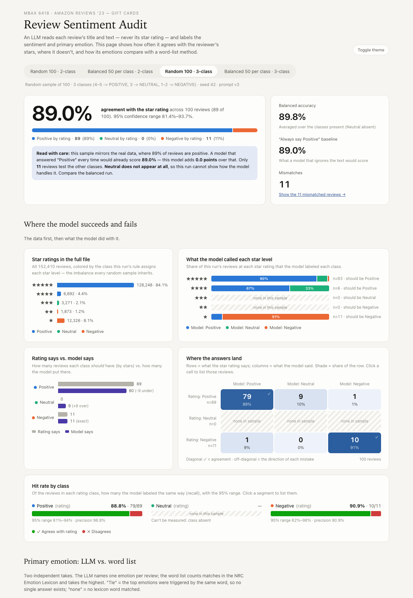
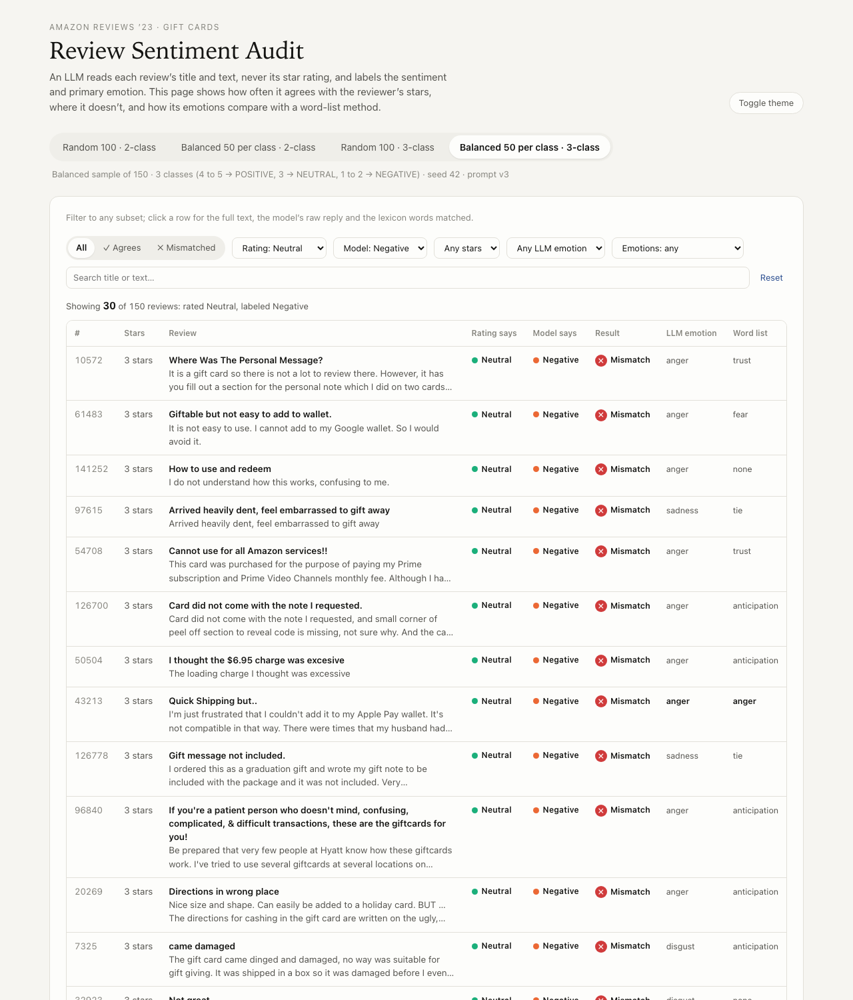
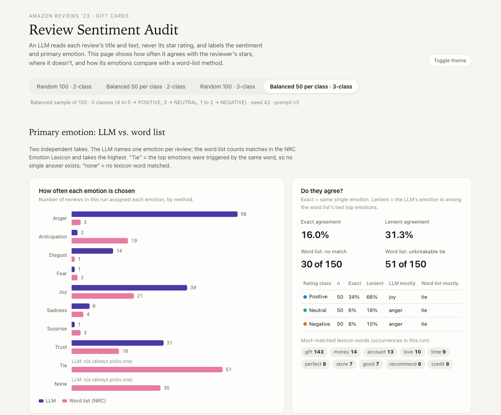
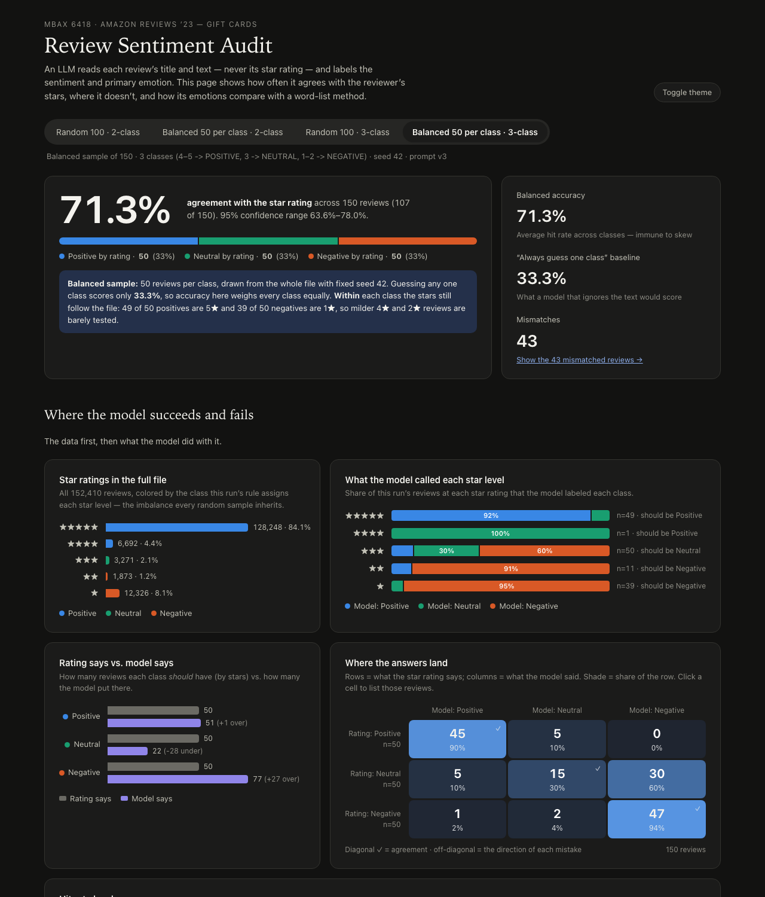

# Review Sentiment Audit — Amazon Gift Card Reviews

**MBAX 6418 · Assignment 1: Sentiment & Emotion Classification**

<!--
  REVIEW BEFORE SUBMITTING: this report was drafted with an AI agent (Claude Code), which
  pulled every number from the files in results/. The brief requires you to (1) check the
  numbers against the saved output yourself and (2) put the framing and conclusions into
  your own words. Delete this comment when done.
-->

An LLM reads each Amazon gift-card review's **title and text only** — never its star rating — and labels its sentiment (positive / neutral / negative) and primary emotion. The star rating is then used as the "correct answer" to score it, and the results are presented in a single-file, offline dashboard.



**Headline:** on positive vs. negative the model agrees with the stars 99.0% of the time on a balanced sample of 100 — though mostly on clear-cut 5★ and 1★ reviews. The moment a neutral class is added, agreement drops to **71.3%**, because **3-star reviews mostly don't get their own class — 30 of 50 were labeled negative.** A random sample hides this completely: it contains no 3-star reviews at all.

---

## Data

- **Source:** Amazon Reviews '23, *Gift Cards* category — Hou, Li, He, Yan, Chen & McAuley, *Bridging Language and Items for Retrieval and Recommendation* (2024), McAuley Lab, UC San Diego.
  Dataset page: <https://amazon-reviews-2023.github.io> · File: <https://mcauleylab.ucsd.edu/public_datasets/data/amazon_2023/raw/review_categories/Gift_Cards.jsonl.gz>
- **Size:** 152,410 reviews (2008-08-06 → 2023-09-06), gzipped JSON Lines, one review per line.
- **Fields kept:** `rating` (the correct answer — never shown to the model), `title` and `text` (the only model input), plus `verified_purchase`, `helpful_vote`, `timestamp`, `asin`, `parent_asin`, `user_id`, and a word count / image count for slicing. 49 reviews have empty text; none have an empty title.
- **The data is heavily imbalanced:**

| Stars | Reviews | Share |
|---|---:|---:|
| ★★★★★ | 128,248 | 84.1% |
| ★★★★ | 6,692 | 4.4% |
| ★★★ | 3,271 | 2.1% |
| ★★ | 1,873 | 1.2% |
| ★ | 12,326 | 8.1% |

88.5% of all reviews are 4–5★; only 2.1% are 3★. Any random sample inherits this.

- **Emotion word list:** NRC Word-Emotion Association Lexicon (EmoLex) v0.92 — Mohammad & Turney (2013), <https://saifmohammad.com/WebPages/NRC-Emotion-Lexicon.htm>. Downloaded by the script and **not committed** (its terms ask that it not be redistributed); the script verifies its SHA-256 before use.

## Model and setup

| | |
|---|---|
| Endpoint | Class OpenAI-compatible endpoint (`http://dobolyi.com:9001/v1`), called with the `openai` Python client |
| Model | `cyankiwi/Qwen3.6-35B-A3B-AWQ-4bit` |
| Settings | temperature 0 · "thinking" disabled · emotion runs use an enum-constrained JSON schema, so the server can only return valid labels |
| Sampling | fixed seed 42 for every run; balanced runs draw an equal number per class from the **whole file** |
| Unparseable replies | 0 in every run |

## Runs

| Run | Classes | Sample | Agreement with rating (95% CI) | "Always say majority" baseline | Balanced accuracy |
|---|---|---|---|---|---|
| Step 2 — random | 2 | 100 random | **98.0%** (93.0–99.4%) | 89.0% | 94.9% |
| Step 2 — balanced | 2 | 50 / 50 | **99.0%** (94.6–99.8%) | 50.0% | 99.0% |
| Step 6 — random | 3 | 100 random | **89.0%** (81.4–93.7%) | 89.0% | 89.8% *(neutral absent)* |
| Step 6 — balanced | 3 | 50 / 50 / 50 | **71.3%** (63.6–78.0%) | 33.3% | 71.3% |

Correct-answer rules: 2-class — ≥4★ positive, else negative. 3-class — 4–5★ positive, 3★ neutral, 1–2★ negative.

Adding the emotion question to the prompt (Step 5) changed **0 of 200** sentiment labels on the two 2-class samples, so the Step 2 numbers carry over unchanged.

---

## Findings

### 1. Why did the lopsided run look so accurate, and what did equal sampling change?

The random 100 mirrors the file: **89 positive, 11 negative, and zero 2★ or 3★ reviews**. A model that ignored the text and always answered "positive" would already score **89.0%**, so the 98.0% headline is only 9 points of real skill, and the negative class rests on 11 reviews — its 90.9% recall has a 95% range of 62–98%.

Balancing did two different things depending on the task:

- **Two classes — the hunch did *not* hold.** The brief hints that the lopsided result flatters the model. Here it didn't: on a 50/50 sample the model scored **99.0%**, catching **50/50** negatives. Positive vs. negative is genuinely easy for this model; the imbalance inflated the *baseline*, not the model.
- **Three classes — balancing exposed the real weakness.** The random 3-class run scores **89.0% — exactly the always-positive baseline** — because it contains **no neutral reviews at all**, so neutral performance is simply unmeasurable. Its only visible symptom is 9 positive reviews (7 five-star, 2 four-star) wrongly called neutral. The balanced 3-class run, 50 per class, drops to **71.3%**, with neutral recall of just **30.0%** (15/50; 95% range 19–44%).

The lesson: a random sample from this file can look excellent while never testing the hardest class.

**A second, subtler imbalance:** "balanced" here means equal numbers *per class*, drawn at random from the file — so each class inherits the file's skew *within* it. In both balanced runs the 50 positives are 49 five-star and 1 four-star, and the negatives are dominated by one-star reviews (39 of 50, the rest two-star, plus 4 three-star in the 2-class run). The 99.0% two-class score is therefore mostly a test on the clearest, most extreme reviews; the milder 2★ and 4★ reviews are barely tested. Sampling per *star level* would be the next step to probe them.





### 2. Where do the mistakes go?

Confusion matrix, balanced 3-class run (rows = what the stars say, columns = what the model said):

| Rating says ↓ / Model says → | Positive | Neutral | Negative | n |
|---|---:|---:|---:|---:|
| **Positive** | **45** | 5 | 0 | 50 |
| **Neutral** | 5 | **15** | 30 | 50 |
| **Negative** | 1 | 2 | **47** | 50 |

- **Neutral collapses downward into negative, not the other way round.** 30 of 50 three-star reviews (60%) were labeled negative; only 2 of 50 negative reviews (4%) were called neutral.
- As a result the model **over-predicts negative: 77 labels vs. 50 true negatives**, so negative precision is only **61.0%** even though negative recall is **94.0%**. Neutral is under-predicted (22 labels vs. 50).
- Positive is mostly right (**90.0%** recall); its 5 misses went to neutral — terse, flat reviews such as *"It's a gift card....,what more is there to say ?"* (5★) and *"Gas card."* (5★).
- **Reading the 30 neutral→negative reviews, most are complaints**: a missing gift message, a dented card, a $6.95 loading fee, a card that won't add to Apple/Google Wallet. The text is negative; the reviewer just chose a middling score. So much of this "error" is a disagreement between what reviewers *write* and what they *rate*, not a misreading — the model is judging text, and 3★ text in this category is mostly unhappy.
- The same pattern is visible in the 2-class balanced run: all 4 three-star reviews it happened to include were labeled negative.



A few 2-class "mistakes" also look like rating errors rather than model errors: a 1★ review reading *"Not much you can say other than it works"*, and a 5★ review that is a joke about the *House of the Dead* video game.

### 3. How do the LLM's emotions and the word list's emotions differ, and why?

Balanced 3-class run (150 reviews):

| | LLM | Word list (NRC) |
|---|---|---|
| Most common answers | anger 56, joy 39, trust 31, disgust 14 | joy 21, anticipation 19, trust 16 |
| No answer possible | — | **none 30** (no lexicon word matched) · **tie 51** (tied top emotions triggered by the same word) |

- **They rarely agree: 16.0% exact**, 31.3% if the LLM's emotion merely appears among the word list's tied top emotions.
- **Agreement collapses on unhappy reviews:** exact agreement is 34% for positive reviews but **6% for neutral and 8% for negative**. On the 50 negative reviews the LLM says *anger* 38 times; the word list says *anger* twice.
- **Why:**
  1. **The words that carry complaints aren't in the lexicon.** "scam", "refund", "card", "amazon", "cheated", "useless" and "ripoff" have no emotion in NRC. A review like *"Card had a $0 balance, Amazon won't refund me"* has no anger words at all, while the LLM reads the situation.
  2. **Domain words dominate and mislead.** "gift" is linked to anticipation, joy *and* surprise, and matched 143 times across 68 of the 150 reviews. 36 of the 51 ties involve "gift", and 22 ties are exactly its anticipation/joy/surprise set. "money" is linked to anger, anticipation, joy, surprise *and* trust at once. The word list is scoring the product category, not the reviewer's feeling.
  3. **No context:** the lexicon can't handle negation ("not happy"), sarcasm, or the fact that *what happened* (a card that didn't activate) implies anger without any emotional words.
  4. **Reviews are short** (median 8 words), so a word count has very little to work with — 30 of 150 matched nothing.
- **Caveat on the LLM side:** its emotions aren't checked against any ground truth either. They are consistent with the sentiment labels and more plausible on reading, but the prompt's definitions (e.g. "satisfied → trust or joy") shape them.



### 4. Bugs and issues hit along the way, and the workarounds

| Where | Issue | Workaround |
|---|---|---|
| Model call | The class model is a *thinking* model: by default it spent 169 hidden tokens reasoning (saved probe in `results/report_supporting_numbers.txt`) before answering, so a short reply limit returned **empty** answers, and reasoning text containing both labels could fool the parser. | Disabled thinking through the chat template, and strip any `<think>` block before parsing. Replies went from 1.24 s to 0.11 s in the saved probe. |
| Parsing | Free-text JSON from a model can be malformed. | Used the endpoint's enum-constrained JSON schema: 0 unparseable replies across all runs. |
| Sampling | The random 100 contained no 2★/3★ reviews, so neutral recall was 0/0 and balanced accuracy / macro-F1 came out `NaN` — and `NaN` isn't valid JSON, which would have broken the dashboard. | Averages now use only the classes present and name the absent class; `NaN` → `null`; the dashboard shows hatched "none in this sample" areas instead of a fake 0%. |
| Word list | My first tie-break ("earliest word wins") couldn't separate emotions triggered by the *same* word and silently fell back to alphabetical order, handing ~20% of reviews to "anticipation". | Unbreakable ties are now labeled `tie`, with the tied set kept; agreement is reported both strictly and leniently. |
| Charts | Very small values (the 1.2% 2★ bar, a 1-review segment, a 4★ row with n=1) risk rendering at 0 px — the layout bug the brief warns about. | `min-width: 3px` on every non-zero bar. Verified by **measuring rendered widths in the browser** at 1280 px and 375 px: 0 collapsed. |
| Colors | Neutral was first drawn in gray, which failed a colorblind/chroma validator; yellow and pink failed next to orange. | Blue / aqua / orange passes every pairwise check in light and dark mode. |
| UI | Run tabs wrapped into a broken pill on phones; a filter label broke onto two lines; review text showed raw `<br />` tags. | Scrolling tabs, `nowrap` labels, `<br />` converted to spaces/newlines. |
| Screenshots | The in-app browser pane and headless Chrome both captured **blank** images after scrolling. | Added a `?section=` deep link that shows just the requested card under the header, and captured with headless Chrome. |
| Repeatability | Re-scoring live at temperature 0 still changed 1 of 150 sentiment labels and 5 of 150 emotions (GPU batching nondeterminism). | Published numbers are computed only from the saved raw output; the re-run result is reported openly (see *Repeatability, checked*). |
| Reproducibility | The full-file star chart needed the raw data, which isn't committed. | The generator saves `results/dataset_summary.json`, so the dashboard rebuilds from a fresh clone. |
| Working with the agent | <!-- Add your own experience here: e.g. early on the agent wrote scripts without running them because of a saved preference, and switching it to "run everything" was faster; anything you had to correct or re-check yourself. --> | |

**Numbers check:** `verify_dashboard.js` compares every number on the page against the saved metrics and rows, in the browser: **429 checks, 0 mismatches** across all 4 runs, plus a width check on 156 bars and segments at phone width (record in `results/dashboard_check.txt`).

---

## The dashboard

`dashboard.html` is one self-contained file: open it in any browser, with no server or internet needed. Tabs switch between the four runs; it opens on the balanced 3-class run.

- Headline agreement with a 95% range, the "always guess" baseline, balanced accuracy, and a plain-language note on imbalance.
- The full-file star distribution; what the model called each star level; rating-says vs. model-says counts; a clickable confusion matrix; per-class hit rates with confidence ranges.
- LLM vs. word-list emotions, with agreement by class and the most-matched lexicon words.
- A filterable review table (agrees / mismatched, rating class, model label, stars, LLM emotion, emotion agreement, text search) with a live count. Clicking a matrix cell or a bar filters it, and each row expands to the full text, the model's raw reply and the lexicon words matched.
- Light and dark themes. All colors are variables in one block at the top of the file, so it can be recolored in one place.
- Deep links: e.g. `dashboard.html?truth=NEUTRAL&pred=NEGATIVE#150_balanced_s42_c3_emo`.



## Reproduce

```bash
python3 -m venv .venv && source .venv/bin/activate
pip install -r requirements.txt
cp .env.example .env            # endpoint URL, key and model name
python data_loader.py           # Step 0: download + read the data (~12 MB)
python spot_check.py            # Step 1: prompt spot-check
python score_batch.py                                          # Step 2: random 100, 2-class
python score_batch.py --balanced                               # Step 2: 50/50
python score_batch.py --emotion && python score_batch.py --emotion --balanced   # Step 5: + emotion
python score_batch.py --classes 3 --emotion                    # Step 6: random 100, 3-class
python score_batch.py --classes 3 --emotion --balanced --n 150 # Step 6: 50 per class
python emotion_lexicon.py       # Step 5: word-list emotions (downloads NRC on first run)
python build_dashboard.py       # writes dashboard.html
python report_numbers.py        # supporting figures quoted in this report (add --probe to re-time the endpoint)
```

Scoring resumes where it left off, and a re-run with the same seed re-uses the saved rows rather than calling the model again.

**Repeatability, checked** (`python check_repeatability.py` → `results/repeatability_check.txt`):

- **Which reviews are used is fixed.** Re-drawing every saved run with its seed (42) gives identical review IDs and correct answers for all six runs.
- **Every published number regenerates exactly.** Recomputing all metrics from the saved rows and rebuilding the dashboard reproduces the committed files byte for byte.
- **Live re-scoring is close but not perfectly deterministic, even at temperature 0.** Re-sending all 150 reviews of the balanced 3-class run gave 149 of 150 identical sentiment labels and 145 of 150 identical emotions (accuracy 72.0% vs. the saved 71.3%, well inside its 95% range). This is typical of a shared GPU inference server, where request batching causes tiny floating-point differences. The saved raw output is therefore the record every number is computed from.
- **The model never sees the rating.** The same check captures every request sent to the endpoint: the user message is exactly the title + text template in all 150, and the prompt contains no mention of stars or ratings.

**Number audit:** `python check_readme_numbers.py` recomputes every figure quoted in this README from the saved output and confirms it appears here exactly (`results/readme_number_check.txt`).

## Files

| Deliverable | File |
|---|---|
| The prompt | `sentiment.py` (v1 two-class · v2 + emotion · v3 three-class + emotion) |
| Scoring script | `score_batch.py` (uses `llm_client.py`, `data_loader.py`) |
| Word-list emotion script | `emotion_lexicon.py` |
| Dashboard generator | `build_dashboard.py` + `dashboard_template.html` |
| One balanced run's raw output | `results/batch_150_balanced_s42_c3_emo.csv` (every review, correct answer, prediction, LLM emotion, raw model reply, word-list emotion and matched words) |
| Final dashboard | `dashboard.html` |
| Supporting | `spot_check.py`, `verify_dashboard.js`, `report_numbers.py`, `check_repeatability.py`, `check_readme_numbers.py`, `results/*_metrics.json`, `results/*_report.txt`, `ISSUES_LOG.md` |

`data/` (raw reviews and the NRC lexicon) and `.env` are git-ignored.

## Limitations

- Samples are small (100–150 reviews), so per-class figures carry wide confidence ranges, shown throughout.
- Balanced samples are balanced by class, not by star level: 4★ (1 review per run) and 2★ reviews are barely represented.
- The star rating is treated as the truth, but some ratings clearly disagree with their own text.
- One model at one temperature; the prompt's edge-case rules (e.g. "'ok' is neutral") shape the neutral results.
- LLM emotions have no ground truth; the comparison shows disagreement, not which method is right.
